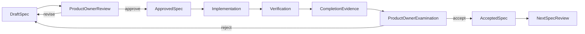

# Specification execution protocol

This protocol prevents the roadmap from turning into an uncontrolled,
multi-phase implementation. It applies to every specification under
`docs/roadmap/`.

## Status lifecycle

Every specification has exactly one status:

1. `draft` — written but not approved for implementation.
2. `approved` — reviewed by the product owner and authorized for implementation.
3. `in-progress` — implementation has started.
4. `blocked` — implementation cannot continue; the blocker and required
   decision are recorded.
5. `in-review` — implementation and verification are complete and awaiting
   product-owner examination.
6. `accepted` — the product owner has accepted the evidence and outcome.
7. `rejected` — the result was examined and must be redesigned before further
   implementation.

Only the product owner can move a specification from `draft` to `approved` or
from `in-review` to `accepted`. The coding agent records all other transitions.

## One-specification rule

- At most one specification may be `in-progress` or `in-review`.
- No implementation work from a later specification may be bundled into the
  active specification.
- No later specification may begin until every dependency is `accepted`.
- Research needed to clarify the active specification is allowed; speculative
  implementation of later work is not.
- If implementation reveals a material architecture or product choice missing
  from the approved specification, work pauses and the product owner is asked.
- Security fixes required to make the active specification safe are in scope
  and must be disclosed. Unrelated cleanup is not.

## Review cycle

## Definition of ready

A specification may be approved only when it has:

- one clear user or system outcome;
- explicit scope and non-goals;
- dependencies that are already accepted or externally available;
- security, privacy, provenance, and tenant-isolation requirements;
- measurable acceptance criteria;
- a verification and demonstration method;
- identified user decisions with no unresolved material ambiguity; and
- no required secret values written in the document or repository.

## Definition of done

Before a specification moves to `in-review`, its implementation must have:

- completed every accepted requirement;
- passed relevant unit, integration, security, and end-to-end checks;
- preserved tenant/user isolation and source provenance;
- added or updated evaluation cases for every observed misfire;
- documented migrations, configuration, and operational behavior;
- committed and pushed each logical change;
- updated the pull request with scope and verification evidence;
- left the working tree clean; and
- recorded known limitations without presenting them as completed behavior.

The product owner then examines the output. Only explicit acceptance unlocks
the next specification.

## Required completion evidence

Each active specification must append or link evidence containing:

- commit identifiers;
- changed files and interfaces;
- tests and exact results;
- demo steps and observed output;
- evaluation report paths and before/after metrics;
- security and privacy checks;
- data migrations and rollback method;
- unresolved limitations; and
- the product owner's final decision.

Evidence must not contain secrets, raw credentials, private recordings, full
employee transcripts, or unnecessary personal data.

## Blocking external dependencies

An external dependency is not considered complete because an adapter was
scaffolded. It must be exercised against the intended environment.

Examples:

- TrueFoundry requires valid secret-injected credentials and a representative
  internal recording.
- Timestamp provenance requires the configured STT model to return usable
  timestamp-bearing segments.
- OneNote requires a confirmed page-write API. The Microsoft 365 MCP currently
  connected to this project does not expose one.
- Asana or Microsoft write actions require a real dry run and an idempotency
  replay test before acceptance.

When an external dependency is unavailable, the specification becomes
`blocked`; later dependent specifications do not silently bypass it.

## Scope-change rule

If the product owner changes an accepted behavior:

1. stop implementation at a safe point;
2. update the active specification;
3. return it to `draft`;
4. review the changed acceptance criteria; and
5. resume only after re-approval.

This keeps the repository, implementation, and product intent aligned.
