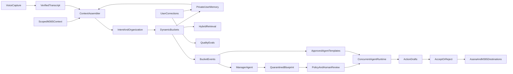

# Donna.ai delivery roadmap

This directory is the execution source of truth for taking Donna from the
current MVP scaffold to a private, context-aware personal assistant and,
later, an approval-gated bucket-agent swarm.

The roadmap is intentionally gated. A phase contains ordered specifications.
Only one specification may be implemented at a time, and implementation does
not begin until the product owner has reviewed and approved that specification.
The next specification remains untouched until the current one is implemented,
verified, demonstrated, and accepted.

See [EXECUTION.md](./EXECUTION.md) for the mandatory review workflow and
[DECISIONS.md](./DECISIONS.md) for the product decisions already agreed.

## Current position

- Existing baseline: voice file → transcript → atomic thoughts → embeddings →
  dynamic buckets → tenant/user-partitioned file storage.
- Current interface: internal CLI.
- Current model strategy: foundation models accessed through the company
  TrueFoundry gateway; Donna owns memory, context, routing, evaluation, and
  workflows.
- Current roadmap state: all specifications are drafts awaiting individual
  review.
- First candidate for review: Phase 1, Specification 1.1.

## Target system

## Ordered phases

1. [Phase 1 — Trustworthy core](./phase-01-trustworthy-core/README.md)
   Prove the real gateway path, persist transcripts, verify provenance, and
   enforce the seven-day encrypted audio lifecycle.
2. [Phase 2 — Private memory and personalization](./phase-02-private-memory/README.md)
   Add explicit memory layers, context assembly, correction-driven learning,
   and consented session emotion.
3. [Phase 3 — Retrieval and production storage](./phase-03-retrieval-storage/README.md)
   Make stored knowledge findable, then move concurrent state to
   tenant-isolated PostgreSQL and pgvector.
4. [Phase 4 — Evaluation moat](./phase-04-evaluation-moat/README.md)
   Measure the complete loop, personalization improvement, privacy, latency,
   and cost with regression gates.
5. [Phase 5 — Microsoft 365 grounding](./phase-05-microsoft-365/README.md)
   Bind Entra identity, add scoped read context, and implement reviewed
   Microsoft destinations, including OneNote when its API is available.
6. [Phase 6 — Controlled CLI pilot](./phase-06-cli-pilot/README.md)
   Run a consented volunteer pilot and graduate only when measured quality
   gates pass.
7. [Phase 7 — Bucket-agent swarm](./phase-07-agent-swarm/README.md)
   Add durable bucket events, independent workers, approvals, idempotency,
   auditing, and approved common agent templates.
8. [Phase 8 — Manager-generated agents](./phase-08-manager-agents/README.md)
   Generate quarantined personal agent blueprints for unmatched buckets, with
   policy checks, dry runs, and reviewed promotion.
9. [Phase 9 — Product graduation and public readiness](./phase-09-product-graduation/README.md)
   Build desktop and Teams surfaces (mobile is a later companion), then
   separate company-only
   infrastructure before any public launch.

Phase numbers express dependency order, not calendar estimates. Evaluation
work begins early, but Phase 4 is where the complete gate is formalized.

## CLI graduation gate

Donna does not move from the controlled CLI pilot to the desktop and Teams
surfaces until the accepted evaluation reports demonstrate:

- at least 95% atomic-thought coverage;
- at least 95% task recall;
- at least 85% first-pass bucket acceptance;
- 100% valid provenance;
- at least 80% successful retrieval;
- zero tenant-isolation failures; and
- zero duplicate external actions.

Passing averages cannot hide a security or provenance failure. Any
tenant-isolation breach, unapproved external mutation, or unverifiable
provenance blocks graduation.

## Non-negotiable boundaries

- The company TrueFoundry gateway is for the internal company pilot only.
- Tenant and user identity come from authenticated context, never request
  parameters, once the product leaves the single-user CLI.
- Personal memory belongs to the employee. Employers do not receive a hidden
  psychological profile.
- Emotional inference is uncertain session context and is not persisted unless
  the employee explicitly opts in.
- Microsoft 365 context is limited to calendar and user-selected emails, Teams
  threads, and files. There is no blanket mailbox ingestion.
- Agents can read, reason, research, and draft before approval. Every external
  write, send, assignment, or share requires accept/reject.
- Manager-generated agents never receive credentials or tools automatically.
- Every model change remains configuration-driven and must beat the existing
  evaluation baseline.

## Repository relationship

The current implementation remains in:

- [`packages/core`](../../packages/core)
- [`packages/pipeline`](../../packages/pipeline)
- [`packages/providers`](../../packages/providers)
- [`packages/buckets`](../../packages/buckets)
- [`packages/evals`](../../packages/evals)
- [`apps/cli`](../../apps/cli)

Each phase specification names the expected files and new packages, but those
paths are proposals until that specification is approved.
